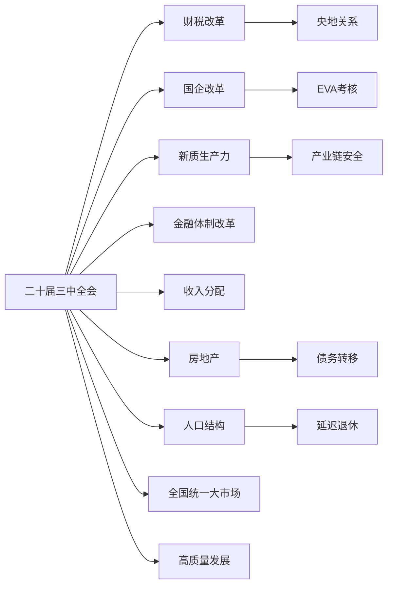

# 二十届三中全会

> **核心结论**：二十届三中全会是**延续原有路线**，不是重开新路线，是二十大的延伸与细化。

## 一、会议定位

| 文件 | 发布日期 | 内容定位 |
|------|----------|----------|
| 公报 | 7月18日 | 议程、定位、形势分析、人事安排 |
| 说明 | 7月22日 | 议题考虑、起草过程、基本框架 |
| 决定 | 全会 | 改革重点内容、落实安排（约2万字）|

**历史坐标**：十八届三中全会（2013）→ 十九届三中全会（2018）→ 二十届三中全会（2024）

## 二、十大议题对比

| 议题 | 十八届三中全会 | 二十届三中全会 |
|------|---------------|---------------|
| 一 | 经济体制 | 经济体制 |
| 二 | 资源配置 | **高质量发展**（新） |
| 三 | 宏观调控 | **科教人才**（新） |
| 四 | 财税体制 | 宏观调控 |
| 五 | 城乡融合 | 城乡融合 |
| 六 | 对外开放 | 对外开放 |

> [!note] 新议题解读
> - "高质量发展" = 结束高速发展周期，进入新常态
> - "科教人才" = 实施科教兴国战略，为产业升级提供人才支撑

## 三、核心改革领域

### 3.1 财税改革

**三条主线**：开源（消费税下划等）、节流（减少地方配套资金）、事权上收中央。

详见：[[财税改革]]

### 3.2 国企改革

**核心转变**：从"做大" → "做强做优"，考核从**利润** → **经济增加值（EVA）**。

详见：[[国企改革]]

### 3.3 新质生产力

以高技术、高能效、高质量为特征，聚焦新能源车、氢能、新材料、生物医药、航空航天、量子技术、生命科学、人工智能等战略领域。

详见：[[新质生产力]]

### 3.4 金融体制改革

提高直接融资比重（当前约30% vs G20均值65-75%），推动长期资金入市，制定金融法。

详见：[[金融体制改革]]

### 3.5 收入分配

三次分配体系：初次（市场效率）、再分配（税收社保）、三次（道德捐赠）。核心挑战：如何让"不老实的人"也参与进来。

详见：[[收入分配]]

### 3.6 房地产

**核心逻辑**："债务不是手段而是目的"——债务转移到普通人身上，驱动劳动意愿。政策调控目标是震荡托底，不能猛涨也不能猛跌。

详见：[[房地产]]

### 3.7 人口结构

三大应对：延迟退休、养老金调整、生育支持政策。东亚生育率诅咒难以逆转（中国总和生育率已降至1.16）。

详见：[[人口结构]]

### 3.8 全国统一大市场

公用事业定价机制改革：减少政府补贴，让要素价格由市场供求决定，"该涨价就得涨价"。

详见：[[全国统一大市场]]

## 四、经典命题

> **"债务不是手段而是目的"**
> 通过让人民相信"未来会更好、房价会涨"，诱导自愿加杠杆。等债务转移完毕，再看到真相。铁链从拴在脖子上，变成了转移到债务上。

> **"错把巅峰当寻常，殊不知一出生即是巅峰"**

> **"时代的一粒沙就是个人身上的一座山"**

## 五、与其他概念的关系

## 六、参考来源

- Source: [[2024-12-18-二十届三中全会细节解析-巫师财经]]
- 公报/说明/决定原文（2024年7月）
