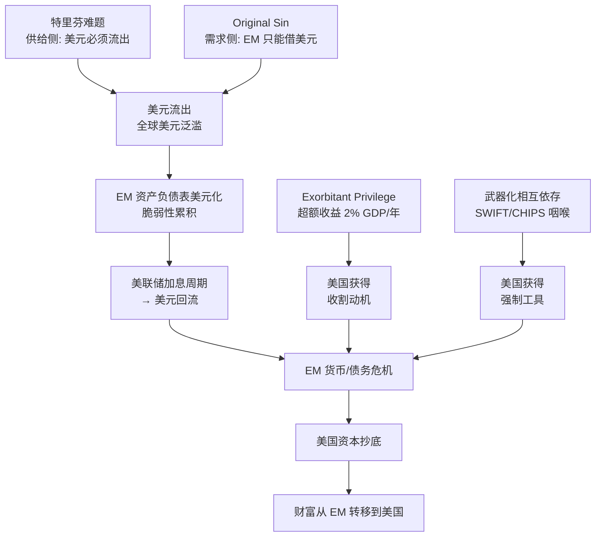
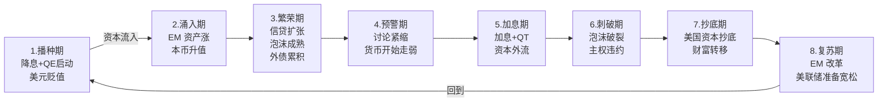
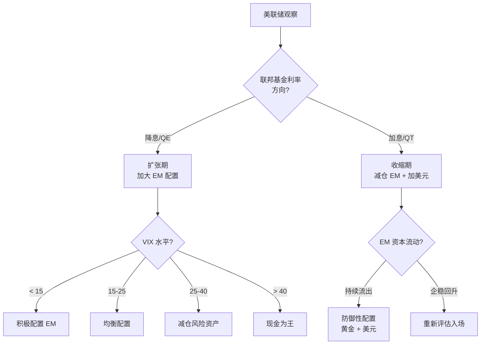

# 研究：美元如何收割新兴市场（增强版）

> **一句话回答**：美元收割 EM = 美联储放水时美元流向 EM 推高资产 → 加息时美元回流引爆货币/债务危机 → 美国资本以美元抄底优质资产。**这不是阴谋**，而是 [[特里芬难题]] + [[Original Sin（原罪）]] + [[Exorbitant Privilege（过度特权）]] + [[武器化相互依存]] 四大理论框架共同作用的结构性产物。**2026 年观察**：美元特权仍在但缓慢削弱，新一轮周期可能在 AI Capex 泡沫破裂时开启。

---

## 摘要

**问题**：美元如何收割新兴市场？

**核心答案**：美元通过**"潮汐效应"**（[[美元潮汐]]）——美联储降息+QE 时推高 EM 资产吸引资本流入积累泡沫，加息+QT 时抽水引爆 EM 货币/债务危机——完成一个完整的收割循环。

**三层结构**：

1. **理论层**：四大框架支撑（Triffin 供给侧 + Original Sin 需求侧 + Rey 传导 + Weaponized Interdependence 强制工具）
2. **机制层**：汇率 + 资产负债表 + 资本流动三大渠道
3. **实证层**：1982-2024 共 11 次 EM 危机可量化验证

**2026 新特征**：日元利差交易（2024.8 历史性清空）+ Trump 2.0 关税（2025.4 解放日）+ AI Capex 泡沫（2026 指引 $6,500 亿）成为下一轮周期的新工具。

---

## 目录

- [一、核心命题与四大理论框架](#一核心命题与四大理论框架)
- [二、三大传导机制](#二三大传导机制)
- [三、完整收割循环（8 阶段）](#三完整收割循环8-阶段)
- [四、历史案例地图（11 个案例）](#四历史案例地图11-个案例)
- [五、量化实证数据](#五量化实证数据)
- [六、EM 脆弱性矩阵](#六em-脆弱性矩阵)
- [七、当前周期观察（2024-2026）](#七当前周期观察2024-2026)
- [八、EM 的应对策略与去美元化](#八em-应对策略与去美元化)
- [九、关键洞察](#九关键洞察)
- [十、操作手册（投资者/政策制定者）](#十操作手册投资者政策制定者)
- [十一、未解问题](#十一未解问题)
- [十二、参考资料](#十二参考资料)

---

## 一、核心命题与四大理论框架

### 1.1 美元为什么能"收割"？

```
美元的三重身份：
  ① 储备货币（全球外汇储备 57%）
  ② 贸易结算货币（全球贸易 ~54%）
  ③ 跨境融资货币（全球跨境贷款 60%+）

+ 美债作为全球无风险资产锚
+ SWIFT + CHIPS 作为全球美元清算体系
     ↓
结果：
  - 全球央行必须持有美元和美债
  - 全球贸易大量用美元结算
  - 全球融资大量以美元计价
  - 美联储政策直接影响全球流动性
     ↓
美元收割的四大理论支柱：
  ① 特里芬难题 → 美元必须流出（供给侧）
  ② Original Sin → EM 只能借美元（需求侧）
  ③ Exorbitant Privilege → 美国获得超额收益
  ④ 武器化相互依存 → 美元作为强制工具
```

### 1.2 四大理论框架（详见各专页）

#### 框架 1：特里芬难题（供给侧困境）

[[特里芬难题]]（Triffin, 1960）：美国必须输出美元满足全球储备需求（导致逆差），但持续逆差终将摧毁美元信用。这是美元霸权的**内在矛盾**——1960s 历史应验（1971 美元脱钩黄金），2020s 新特里芬事件风险上升（CEPR 2024 警告）。

**现代扩展**：Eichengreen 2005 / Farhi-Maggiori 2017 / Murau 2020 / Bassano 2024

#### 框架 2：Original Sin（需求侧约束）

[[Original Sin（原罪）]]：EM 无法在国际市场以本币借取长期资金（甚至国内长期资金也受限制），导致货币错配 + 期限错配 + 金融脆弱性。**这是美元债"双杀"效应的微观金融基础**——没有原罪就没有资产负债表渠道。

**量化**：跨境借款中美元仍占 90%+（Miranda-Agrippino & Rey 2022）

#### 框架 3：Exorbitant Privilege（超额收益）

[[Exorbitant Privilege（过度特权）]]：美国因美元储备地位获得**约 2% GDP/年的"中介溢价"**（低成本借款 + 通胀输出 + 金融制裁权）。这是美元收割机制的**收益来源**。

**关键数据**：美元贬值 10% → 美国 NIIP 改善 GDP 的 5.9%（2004）

#### 框架 4：武器化相互依存（强制工具）

[[武器化相互依存]]（Farrell-Newman, 2019）：美国通过控制 SWIFT/CHIPS 等"咽喉节点"，将经济相互依存转化为强制工具。**2022 俄罗斯案例**（冻结 3000 亿美元外储 + 7 家银行移出 SWIFT）是最大实证。

**反作用**：mBridge、CIPS、BRICS Pay 加速发展，央行黄金购买创纪录。

### 1.3 框架整合图谱



---

## 二、三大传导机制

### 2.1 汇率机制

```
美联储加息 → 美元升值（DXY ↑）
     ↓
EM 货币被迫贬值
  - 钉住美元的：一次性贬值（泰国 1997、阿根廷 2001）
  - 浮动的：逐步贬值（韩国 1997、斯里兰卡 2022）
     ↓
EM 美元债务本币计价飙升 → 还债压力暴增
     ↓
输入型通胀 → EM 央行被迫跟随加息 → 经济衰退
```

**量化（峰值-谷值）**：
- 韩元（1997）：844 → 1,995，**-58%**
- 泰铢（1997）：24.35 → 56+，**-54%**
- 阿根廷比索（2001-2002）：1:1 → 4，**-75%**
- 土耳其里拉（2018）：3.5 → 7+，**-50%**
- 斯里兰卡卢比（2022）：200 → 370+，**-46%**

### 2.2 资产负债表机制

```
EM 企业/政府借美元债（短期为主）
     ↓
本币贬值 → 等额美元债的本币价值翻倍
     ↓
资产负债表恶化：
  - 净资产缩水
  - 利息支出飙升
  - 信用评级下调
     ↓
融资冻结 → 被迫抛售资产换美元 → 资产价格暴跌
     ↓
负反馈循环（死亡螺旋）
```

**经典数据**：
- 1997 泰国：短期外债/外储 > 100%
- 1997 韩国：外汇储备 300 亿，短期外债 1,000 亿+
- 2022 斯里兰卡：外储 80 亿 → 5,000 万（-94%）

### 2.3 金融渠道（资本流动）

```
美元利率上升 → 美债收益率上升 → 美元资产吸引力 ↑
     ↓
全球资本回流美国
     ↓
EM 股市、债市、楼市失血
     ↓
汇率压力 + 资产价格下跌
     ↓
"自我实现"的贬值预期 → 资本外逃加速
     ↓
央行外储消耗 → 干预空间耗尽
```

**量化（IIF 数据）**：
- 2010-2012 EM 资本流入：$8,250 亿 + $8,340 亿 + $10,800 亿
- 2013 Taper Tantrum：EM 净流出 ~$10,000 亿
- 2020 COVID Q1：跨境债权增长 +$26,000 亿（季度）
- 2022 Q1：中国减少美元跨境债权 $660 亿

详见 [[汇率传导机制]]、[[美元潮汐量化实证]]。

---

## 三、完整收割循环（8 阶段）



| 阶段 | 名称 | 美联储动作 | 美元 | EM 反应 |
|------|------|----------|------|--------|
| **1** | 播种期 | 降息+QE 启动 | 贬值 | 资本开始流入 |
| **2** | 涌入期 | 维持宽松 | 弱势 | 货币升值 + 资产涨 + 借美元债 |
| **3** | 繁荣期 | 维持宽松 | 底部 | 泡沫成熟 + 外债累积 + 通胀 |
| **4** | 预警期 | 讨论紧缩 | 走强 | 流入放缓 + 货币开始走弱 |
| **5** | 加息期 | 加息+QT 启动 | 强势 | 资本外流 + 货币贬值 |
| **6** | 刺破期 | 持续紧缩 | 强势 | 泡沫破裂 + 违约 + 危机 |
| **7** | 抄底期 | 维持高利率 | 强势 | 美国资本抄底优质资产 |
| **8** | 复苏期 | 准备宽松 | 高位 | EM 改革 + 复苏 + 新周期开始 |

完整周期典型持续 **5-10 年**。详见 [[美元潮汐]]。

---

## 四、历史案例地图（11 个案例）

自 1980 年代以来，美联储**每一次加息周期**几乎都伴随新兴市场危机：

| 案例 | 时间 | 加息周期 | EM 危机 | 触发国 | 严重度 |
|------|------|---------|---------|--------|-------|
| **拉美债务危机** | 1982 | 沃尔克（最高 20%）| 主权违约 + 失去十年 | 墨西哥 | ★★★★★ |
| **龙舌兰危机** | 1994 | 格林斯潘（+300bp）| 比索崩盘 | 墨西哥 | ★★★★ |
| **亚洲金融危机** | 1997-1998 | 格林斯潘 | 货币崩盘 + IMF 救助 | 泰国→东南亚→韩国 | ★★★★★ |
| **俄罗斯卢布危机** | 1998 | 格林斯潘 | 卢布崩盘 + 主权违约 | 俄罗斯 | ★★★★ |
| **阿根廷违约** | 2001-2002 | 格林斯潘 | 钉住美元崩溃 | 阿根廷 | ★★★★ |
| **Taper Tantrum** | 2013 | 伯南克 | 脆弱五国货币普跌 | 印度/印尼等 | ★★★ |
| **俄罗斯卢布危机** | 2014-2015 | 耶伦 | 油价+制裁双重打击 | 俄罗斯 | ★★★ |
| **土耳其阿根廷** | 2018 | 鲍威尔 | 里拉崩盘 + IMF 救助 | 土耳其、阿根廷 | ★★★★ |
| **斯里兰卡违约** | 2022 | 鲍威尔（+425bp）| 首次主权违约 + 总统下台 | 斯里兰卡 | ★★★★★ |
| **全球紧缩** | 2022-2024 | 鲍威尔 | 脆弱国家普遍承压 | 多国 | ★★★ |
| **新一轮周期？** | 2026-? | 任庄主判断 | 待观察 | 待观察 | ? |

**核心规律**：
```
触发条件 = 美联储加息周期 + EM 自身脆弱性（外债、经常账户逆差、汇率僵化）
触发顺序 = 美元走强 → EM 货币贬值 → 资本外逃 → 央行干预 → 资产暴跌 → 违约 → 美国资本抄底
```

详见 [[美元潮汐历史案例]]、[[1997 亚洲金融危机]]、[[2022 斯里兰卡违约]]。

---

## 五、量化实证数据

### 5.1 资本流动（IIF + BIS 数据）

```
流向 EM 私营资本净流入：
  2009: $5,810 亿
  2010: $8,250 亿
  2011: $8,340 亿
  2012: $10,800 亿
  2013: -$10,000+ 亿（Taper Tantrum 大规模流出）
  2020 Q1: +$26,000 亿（季度，COVID 注入）
  2022 Q1: -$660 亿（中国大幅减少美元跨境债权）
```

### 5.2 DXY 历次周期

| 危机 | 峰值 | 谷值 | 涨幅 |
|------|------|------|------|
| 1985 Plaza | 164.72 | ~123 | +33% |
| 2001 互联网 | 119.07 | 110 | +8% |
| 2008 GFC | 82 | 71.30 | -13%（避险）|
| 2022 俄乌+加息 | 114.78 | 95.67 | +20% |
| 2024 | 108.49 | 100.16 | +8% |

### 5.3 IMF COFER 储备份额

```
1999: 美元 71%, 欧元 18%, 人民币 —
2009: 美元 62%, 欧元 27.7% (峰值), 人民币 —
2020 Q4: 美元 58.9% (25年新低), 欧元 21.3%, 人民币 2.1%
2026 Q1: 美元 ~57%, 欧元 ~20%, 人民币 ~2%, 其他 ~17%
```

**总储备量**：2025 Q4 = $13.14 万亿（IMF COFER）

### 5.4 Fed 资产负债表

```
2008.9 (GFC 前): $0.87 万亿
2014.10 (QE3 结束): $4.5 万亿（QE 时代峰值）
2020.3 (COVID 前): $4.2 万亿
2022.3 (峰值): $8.9 万亿（史上最高）
2025.3: $6.7 万亿（- $2.2 万亿 QT）
2025.12: QT 正式结束
2026.7: $6.74 万亿
```

### 5.5 央行黄金购买（去美元化实际进展最大的领域）

```
2022: 1,082 吨（历史最高）
2023: 1,037 吨
2024: 1,044 吨
2025E: ~863 吨
```

中国外储构成变化：美元 37%（2015）→ 21%（2025），黄金 2% → 8%

详见 [[美元潮汐量化实证]]。

---

## 六、EM 脆弱性矩阵

### 6.1 脆弱性 5 维度

| 维度 | 高脆弱 | 低脆弱 |
|------|--------|--------|
| **经常账户** | 逆差 > 3% GDP | 顺差或小逆差 |
| **外债 / GDP** | > 30%（尤其短期） | < 20% |
| **外汇储备** | < 6 个月进口 + < 100% 短期外债 | > 12 个月 + > 200% |
| **汇率制度** | 钉住美元（被动） | 浮动 + 弹性（主动） |
| **资本账户** | 完全开放 | 资本管制（防火墙） |

### 6.2 经典案例对照

| 国家 | 经常账户 | 外债/GDP | 外储 | 汇率制度 | 危机严重度 |
|------|---------|---------|------|---------|----------|
| 泰国（1997） | -8% | 60%+ | $380 亿 | 钉住美元 | ★★★★★ |
| 韩国（1997） | -2% | 35% | $300 亿 | 浮动 | ★★★★ |
| 墨西哥（1994） | -5% | 35% | $60 亿 | 钉住美元 | ★★★★ |
| 土耳其（2018） | -5% | 50% | $80 亿 | 浮动 | ★★★★ |
| 斯里兰卡（2022） | -3% | 60% | $5000 万 | 钉住美元 | ★★★★★ |
| **中国（2026）** | **+1.4% 顺差** | 14% | **$3.2 万亿** | 有管理浮动 | ★（轻度） |

详见 [[脆弱五国（Fragile Five）]]。

---

## 七、当前周期观察（2024-2026）

### 7.1 2024-2026 美元周期大事记

```
2024.7.31 日本央行意外加息 15bp 至 0.25%
  ↓
2024.8.5 历史性日元利差交易清空
  ├── USD/JPY: 155 → 143（4 天跌 8%）
  ├── 日经 225: 单日跌 12.4%（1987 以来最大）
  └── VIX 盘中突破 65
  ↓
2024.9.18 美联储 -50bp 降息（鸽派转向）
  ├── 联邦基金利率 → 4.75-5.0%
  ├── 鲍威尔：支持劳动力市场的最佳时机
  └── SEP: 2025 降 100bp, 2026 降 50bp
  ↓
2025.4.2 Trump "解放日" 关税
  ├── 基准关税 10%（180 国）
  ├── DXY 24 小时贬 1.7%（理论反常）
  ├── 越南、斯里兰卡、泰国、马来西亚受冲击最大
  └── EM 货币贬值，泰铢 -0.5%、兰特 -1%
  ↓
2025.4 中国"通道"建立（绕开 SWIFT）
  ├── 手续费 0.5-1%（vs 此前 12%）
  └── 不使用 SWIFT 或美元账户
  ↓
2025.9 DXY 区间高点 ~108（2024 升值 9%）
  ↓
2025.12 QT 正式结束（Fed 资产负债表 $6.6 万亿）
  ↓
2026.3 DXY 52 周高 ~101.80
  ↓
2026.6 DXY 52 周低 ~95.55
  ↓
2026.7 DXY 回升至 ~100.50（地缘政治 + AI Capex 担忧）
```

### 7.2 巫师《崩了》分析（2026.3）

```
2026.3.23 全球股灾中：
  ├── 日韩结构性最脆弱
  │   ├── 能源 100% 依赖进口
  │   ├── 韩元创 17 年新低
  │   ├── 日元跌穿 160
  │   └── 半导体权重太大（美联储鹰派 → 估值杀）
  ├── 欧洲刚出俄罗斯坑又掉进中东坑
  │   ├── 滞胀陷阱
  │   └── 货币政策两难
  └── A 股相对抗揍
      ├── 相对封闭 + 能源多元 + 政策工具多
      └── 制造业坚挺
```

### 7.3 韩国"股牛汇弱"

```
2026 年韩国表现：
  - KOSPI +94.67%（全球首位）
  - 韩元 -6.5%（亚洲首位贬值）
  
"股牛汇弱"机制：
  通胀压力 → 韩元贬值预期 → 货币购买力下降
     ↓
  市场将"持有优质企业股权"作为资产保值手段
     ↓
  KOSPI 暴涨（尤其 ICT / 半导体）
     ↓
  股牛汇弱格局强化
     ↓
判断：AI 热潮并非韩国股市走牛的全部原因，通胀压力抬升也是重要推手
适用：日本、中国台湾、尼日利亚等
```

### 7.4 AI Capex 泡沫（下一轮周期的潜在引爆点）

```
2026 顶级超大规模厂商 Capex 指引：
  - 亚马逊 ~$2,000 亿
  - Alphabet $1,750-1,850 亿
  - Meta $1,150-1,350 亿
  - 微软 ~$1,200+ 亿
  - Oracle ~$500 亿
  - 五家合计 ~$6,350-6,900 亿（+67-74% YoY）

历史对比：
  - 2000 互联网泡沫峰值：科技投资占 GDP 1.5%
  - 2025 AI 相关：占 GDP 1%（BIS）
  - 1990 年代电信峰值：占 GDP 5-6%
  
风险信号：
  - Microsoft: AI 营收 $370 亿 vs LTM Capex $970 亿（38% 覆盖）
  - MIT: 95% 组织报告生成式 AI 零回报
  - Gartner: 60% 企业 AI 项目将在 2026 年底前取消
  - CoreWeave: $148 亿债务、4.5x 杠杆、负 $72.5 亿自由现金流、70% 营收来自单一客户 OpenAI

判断：若 AI Capex 泡沫在 2026-2027 破裂，可能引发类似 2000 互联网泡沫对美元周期的传导。
```

### 7.5 当前周期对 EM 的含义

| 维度 | 当前状态 | 历史对照 |
|------|---------|---------|
| **美元指数** | 高位（100-108）| 2018（95-97）、2022（114） |
| **美债收益率** | 高位（4%+）| 2018、2022 紧缩末期 |
| **美联储政策** | 紧缩观望 | 2018.12 鲍威尔"转向"前夜 |
| **EM 资本流动** | 流入放缓 | 2018.09-12、2022.06-09 |
| **EM 货币** | 韩元/日元贬值 | 2018 土耳其阿根廷、2022 斯里兰卡 |
| **AI Capex 风险** | 历史高位 | 1999 互联网泡沫前夕 |

---

## 八、EM 的应对策略与去美元化

### 8.1 四类应对策略

| 策略 | 代表 | 有效性 | 局限 |
|------|------|--------|------|
| **去美元化** | 储备多元化（黄金+人民币）、本币结算、CIPS/SPFS | 中长期 | 美元仍是最佳流动性资产 |
| **资本管制** | 限制短期资本流动、外资持股上限、托宾税 | 短期防火墙 | 长期扭曲市场 |
| **区域联盟** | 金砖、上合、RCEP、CMIM、亚债市场 | 抱团取暖 | 规模小、约束力弱 |
| **汇率弹性** | 浮动汇率 + 通胀目标、有限干预 | 缓冲 | 增加不确定性 |

详见 [[新兴市场为避免被美国薅羊毛采取了哪些措施]]、[[去美元化]]。

### 8.2 去美元化实际进展（2024-2026）

```
储备层：
  美元份额：71%（1999）→ 57%（2026）
  黄金购买：2022-2024 共 3,163 吨（历史最高）
  ↓
清算层：
  SWIFT 替代品：
    - mBridge：5 国央行（CIPS + SAMA + HKMA + BoT + CBUAE）
    - BRICS Pay：2026 末计划全面启动
    - CIPS：142 直接 + 1,394 间接参与者（119 司法管辖区）
    - SPFS（俄罗斯）：约 600 成员
    - UPI（印度）：7 个外国辖区已上线
  ↓
贸易层：
  俄中贸易 90% 本币结算（2024）
  中沙货币互换协议
  中巴本币结算推进
  ↓
货币层（人民币国际化）：
  SWIFT 支付份额：1.9%（2020）→ 4.69%（2024）→ 停滞
  贸易融资份额：6%（全球第二，仅次于美元）
```

**关键判断**：
- 储备层去美元化：**实质进展**（黄金购买）
- 清算层去美元化：**基础设施在建设但互操作性差**
- 货币层去美元化：**增长但已停滞**
- 借款层去美元化：**基本未动**（美元仍占 90%+）

---

## 九、关键洞察

### 9.1 不是阴谋，是结构

```
"美元收割全球"不是美国政府的阴谋
而是美元储备货币地位 + 美债无风险锚 + SWIFT 美元清算的副产品

美联储政策服务于美国国内目标，但会"溢出"到全球
这是国际货币体系的"特里芬难题"的具体表现

理论支撑（四大框架）：
  - 特里芬难题：供给侧困境
  - Original Sin：需求侧约束
  - Exorbitant Privilege：超额收益
  - 武器化相互依存：强制工具
```

### 9.2 三层不平等

```
层次 1：货币主权不平等
  - 美国可以"印钱买世界"
  - EM 不能"印钱还债"

层次 2：金融基础设施不平等
  - 美联储是全球事实上的"央行"
  - EM 是"用户"

层次 3：周期承受不平等
  - 美国享受"放水期"的繁荣
  - EM 承担"紧缩期"的危机
```

### 9.3 边际效应递减

```
每一次美元潮汐，EM 都在积累"免疫力"：
  - 1997 后 EM 普遍积累外储
  - 2008 后 EM 普遍降低外债
  - 2014 后 EM 普遍增加汇率弹性
  - 2022 后 EM 普遍推动去美元化

但同时，美国也在升级工具：
  - 2008 后：QE 规模史无前例
  - 2020 后：财政货币化（MMT）
  - 2022 后：金融制裁武器化（俄罗斯案例）
  - 2024 后：日元利差交易成新传导渠道
  - 未来：数字美元 + CBDC 跨境桥接

判断：美元潮汐不会消失，但烈度可能递减，EM 的"防御工具箱"在扩张
```

### 9.4 防御 > 替代

```
短期：
  - 充足外储 > 汇率弹性 > 资本管制 > 通胀控制
  
中期：
  - 经济结构多元化 > 出口升级 > 制造业完整
  
长期：
  - 本币国际化 > 区域金融合作 > 去美元化

最根本：
  - "只有实体经济的强健才是真正的防火墙"
```

---

## 十、操作手册（投资者/政策制定者）

### 10.1 个人/机构投资者操作指南

#### A. 识别美元周期阶段（基于 7 个量化指标）



**核心信号灯**：
- **LIBOR-OIS 利差扩大** → 美元流动性紧张 → 做多美元，减仓 EM
- **TGA 余额下降** → 财政放水 → 风险偏好改善
- **Fed Reverse Repo 用量骤降** → 流动性从过剩转正常 → 边际收紧
- **美联储缩表/暂停** → 流动性减少 → 警惕 EM 流出

#### B. EM 国别配置框架

**避免清单（脆弱五国 + 高危）**：
- 经常账户逆差 > 3% GDP
- 外债/GDP > 30%
- 外储 < 6 个月进口
- 钉住美元制度
- 完全开放资本账户

**优先清单**：
- 经常账户顺差或小逆差
- 外债/GDP < 20%
- 充足外储（> 12 个月进口）
- 浮动汇率 + 通胀目标
- 资本管制或选择性开放

### 10.2 政策制定者防御清单

#### A. 短期防火墙（6-12 个月）

1. **积累外储** — 至少 6 个月进口 + 100% 短期外债覆盖
2. **限制短期外币贷款** — 宏观审慎工具
3. **建立或强化资本管制** — 限制短期资本流动
4. **汇率弹性管理** — 避免钉住美元制度

#### B. 中期结构改革（1-5 年）

1. **发展本币国债市场** — 建立收益率曲线锚
2. **主权信用评级改善** — 降低美元借款溢价
3. **经济多元化** — 减少单一行业依赖
4. **区域金融合作** — CMIM、清迈倡议等

#### C. 长期突破路径（5-20 年）

1. **本币国际化** — 减少美元依赖
2. **建立替代清算网络** — CIPS/SPFS/UPI/mBridge 接入
3. **数字货币桥** — CBDC 跨境结算
4. **黄金储备** — 非主权负债对冲

### 10.3 中国特殊定位

```
中国是 EM 中的"异类"——规模大、产业链完整、资本账户半开放、外储充足、政策工具多。

四重防火墙：
  1. 资本管制（防火墙）
  2. $3.2 万亿外储（保险）
  3. 产业链完整（实体经济强健）
  4. 政策工具箱充足（财政+货币+汇率）

不面临典型 EM 危机路径：
  - 美元贬值 → 储备耗尽 → 危机
  - 但 PBoC 灵活性受限（不能自由降息以防资本外流）

2024-2026 表现：
  - USD/CNY 区间 7.0-7.3
  - PBoC 允许中间价突破 7.20（2023.9 以来最弱）
  - 强调保持人民币"基本稳定"
```

---

## 十一、未解问题

> [!question] 仍待研究的问题
>
> 1. **数字美元 vs CBDC 跨境桥接**：未来 5-10 年，谁将主导跨境支付？会重塑美元收割机制吗？
> 2. **2026 新一轮加息周期的烈度**：任庄主判断"加息周期中或前夜"，但具体加息幅度和节奏如何？
> 3. **金砖国家共同货币**：是否能在 2030 年前成型？能否削弱美元霸权？
> 4. **IMF 改革**：SDR 能否成为新的全球储备资产？美元替代方案？
> 5. **绿色金融**：碳关税、ESG 投资是否会成为新的"收割工具"？
> 6. **AI 资本支出泡沫**：科技股估值高企是否会在美元紧缩时破裂？
> 7. **"中美国"解体的金融影响**：中美脱钩会怎样重塑美元潮汐？
> 8. **新特里芬事件**：CEPR 2024 警告风险，2026 是否会触发？
> 9. **武器化相互依存的反作用**：mBridge + CIPS + BRICS Pay 是否能在 2030 形成替代网络？

---

## 十二、参考资料

### Wiki 内部页面（核心理论）

- [[美元收割全球的机制]] — 三步收割拆解
- [[美元潮汐]] — 8 阶段收割循环完整流程
- [[美元周期]] — 加息降息周期规律
- [[美元霸权]] — 美元的地位
- [[全球金融周期]] — Rey 二元悖论
- [[美元流动性]] — 三层结构 + 恐慌进程
- [[汇率传导机制]] — 四大传导渠道
- [[美元微笑理论]] — 美元双向走强
- [[脆弱五国（Fragile Five）]] — 高风险国家组合
- [[美元潮汐历史案例]] — 1980s 以来所有重要 EM 危机
- [[1997 亚洲金融危机]] — 教科书案例
- [[1992 欧洲货币危机]] — 索罗斯击垮英格兰银行
- [[新兴市场为避免被美国薅羊毛采取了哪些措施]] — EM 的四类应对
- [[去美元化]] — 长期解决方案
- [[资本管制]] — 短期防火墙
- [[金融传导机制分析框架]] — 通用分析框架
- [[蒙代尔-弗莱明模型]] — 开放宏观框架

### Wiki 内部页面（学术框架）

- [[特里芬难题]] — 供给侧困境
- [[Original Sin（原罪）]] — 需求侧约束
- [[Exorbitant Privilege（过度特权）]] — 超额收益
- [[武器化相互依存]] — 强制工具
- [[美元潮汐量化实证]] — 量化数据汇总

### 关键 Sources

- [[wiki/sources/2026-03-23-巫师财经-崩了]] — 2026.3 全球股灾分析
- [[wiki/sources/我们已经处于新一轮加息周期中或前夜]] — 任庄主核心判断
- [[wiki/sources/2026-06-24-韩国需要冷静冷静]] — 韩国"股牛汇弱"案例
- [[wiki/sources/2026-06-04-日本史上最大规模汇率保卫战]] — 日本干预案例
- [[wiki/sources/2026-05-13-日元保卫战-日本央行11万亿干预]] — 日本干预细节

### 外部学术文献

| 文献 | 关键贡献 | 引用 |
|------|---------|------|
| Triffin (1960) | 特里芬难题 | Yale UP |
| Eichengreen & Hausmann (1999) | Original Sin | NBER WP 7418 |
| Rey (2013) | Dilemma not Trilemma | Jackson Hole |
| Miranda-Agrippino & Rey (2020) | GFC 实证 | Rev Econ Stud |
| Gourinchas & Rey (2007) | Exorbitant Privilege 量化 | NBER |
| Eichengreen (2011) | 系统专著 | Oxford UP |
| Farrell & Newman (2019) | Weaponized Interdependence | Int Sec 44(1) |
| Farhi & Maggiori (2017) | 新特里芬 | NBER WP 23809 |
| Arslanalp et al. (2024) | Dollar Dominance | IMF WP 24/51 |
| BIS Bulletin 90 (2024) | Yen Carry Trade | bis.org |
| IMF COFER | 储备货币份额 | data.imf.org |
| BoC-BoE | Sovereign Default Database | bankofcanada.ca |

### 外部数据源

| 来源 | URL |
|------|-----|
| **IMF COFER** | data.imf.org/en/datasets/IMF.STA:COFER |
| **IIF Capital Flows** | iif.com/Research/Capital-Flows |
| **Fed H.4.1** | federalreserve.gov/releases/h41 |
| **FRED WALCL** | fred.stlouisfed.org/series/WALCL |
| **BIS LBS** | bis.org/statistics/rppb2024.htm |
| **World Gold Council** | gold.org |
| **SWIFT RMB Tracker** | swift.com |

---

## 一句话总结

> **美元如何收割新兴市场？**
>
> 通过**美元潮汐**——美联储降息+QE 推高 EM 资产吸引资本流入积累泡沫 → 美联储加息+QT 抽水引爆 EM 货币/债务危机 → 美国资本以美元抄底优质资产。
>
> **三大机制**：汇率（美元升值 → 本币贬值 → 外债负担加重）、资产负债表（贬值 → 美元债本币计价翻倍）、金融（资本外逃 → 资产价格暴跌）。
>
> **四大理论框架**：
> 1. **特里芬难题**（供给侧：美元必须流出） — 1960 Triffin → 2024 CEPR 警告
> 2. **Original Sin**（需求侧：EM 只能借美元） — 1999 Eichengreen-Hausmann
> 3. **Exorbitant Privilege**（超额收益：2% GDP/年） — 2007 Gourinchas-Rey
> 4. **武器化相互依存**（强制工具：SWIFT/CHIPS） — 2019 Farrell-Newman
>
> **这不是阴谋**，而是美元储备货币地位 + 美债无风险锚 + SWIFT 美元清算三大支柱的结构性产物。**自 1980 年代以来**，美联储每一次加息周期都伴随新兴市场危机——1982 拉美、1994 龙舌兰、1997 亚洲、1998 俄罗斯、2001 阿根廷、2018 土耳其阿根廷、2022 斯里兰卡违约。
>
> **2024-2026 新工具**：日元利差交易（2024.8 清空）+ Trump 2.0 关税（2025.4 解放日）+ AI Capex 泡沫（2026 指引 $6,500 亿）成为下一轮周期的新传导渠道。
>
> **EM 的应对**：去美元化、资本管制、区域联盟、汇率弹性管理——没有银弹，必须多管齐下。**2026 年观察**：任庄主判断"新一轮加息周期中或前夜"，日韩结构性脆弱，韩元贬值居亚洲首位，新一轮潮汐可能由 AI Capex 破裂触发。